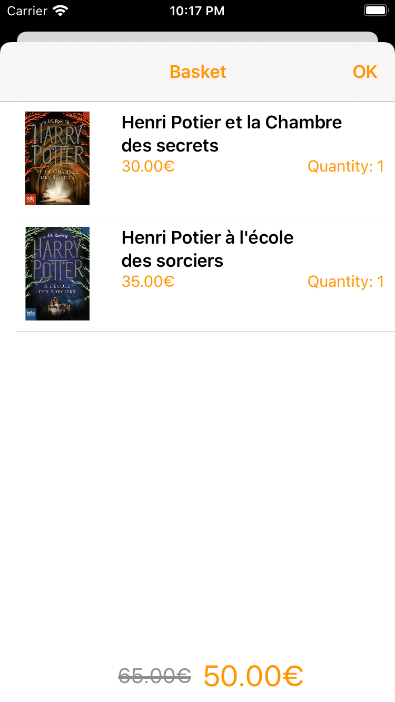

# Exercice Mobile : La bibliothèque d'Henri Potier

## Screenshots

Book Store             |  Selected book		|  Basket
:-------------------------:|:-------------------------:|:-------------------------:
  |  	|  

## Install

Run `bundle install --path vendor/bundle` then `bundle exec pod install`.

## Unit testing

I use Slather to generate coverage report in HTML format.
Open `html/index.html` to see the code coverage.

The ViewModel and Service parts are tested.
